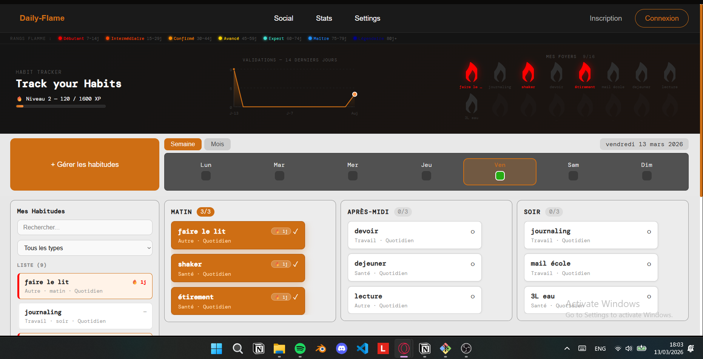

# habit-tracker
# 🔥 DailyFlame ( nom provisoire

> Tracker d'habitudes gamifié avec système de flammes, streaks et XP.

image du prototype : 



## 📁 Structure du projet

Le projet est une **Single Page Application React** (`.jsx`), sans backend pour l'instant. Toutes les données sont persistées dans le `localStorage` du navigateur.

### Composants principaux

```
App                          ← Composant racine, état global, localStorage
│
├── AppHeader                ← Barre de navigation (logo, liens, connexion)
├── LegendeFlammes           ← Bandeau des rangs de flamme (Débutant → Légendaire)
│
├── Hero                     ← Zone principale en haut
│   ├── MiniGraphique        ← Courbe SVG des validations sur 14 jours
│   └── GrilleFlammes        ← Grille 8×2 des 16 habitudes sous forme de flammes
│       └── FlameCell        ← Cellule flamme individuelle avec tooltip au survol
│           └── FlameTooltip ← Popup streak / palier / extinctions
│
├── BarreDate                ← Sélecteur de date (vue semaine ou mois)
│
├── Board principal
│   ├── ListeHabitudes       ← Panneau gauche : liste filtrée de toutes les habitudes
│   └── Colonne (×3)        ← Colonnes Matin / Après-midi / Soir
│       └── CarteHabit       ← Carte cliquable pour valider / dévalider une habitude
│
├── Modal                    ← Gestion des habitudes (ajout / édition / suppression)
│   └── DialogSuppression    ← Confirmation de suppression
│
└── ToastXP                  ← Notification "+10 XP 🔥" animée
```

### Utilitaires et constantes

| Fonction | Rôle |
|---|---|
| `calcStreak()` | Calcule les jours consécutifs validés |
| `calcExtinctions()` | Compte les ruptures de streak |
| `calcDebutStreak()` | Retourne la date de début du streak courant |
| `getPalier()` | Retourne le rang et la couleur de flamme selon le streak |
| `calculerNiveau()` | Calcule le niveau et l'XP restant à partir du total |
| `getDatesLaSemaine()` | Retourne les 7 dates ISO de la semaine courante |
| `getJoursDuMois()` | Retourne tous les jours du mois courant |

### Stockage actuel (`localStorage`)

| Clé | Contenu |
|---|---|
| `df_habits` | Tableau des habitudes (id, nom, type, période, fréquence...) |
| `df_completions` | Tableau des validations (habitId, date, xpGagné...) |
| `df_xp` | Total XP de l'utilisateur (nombre) |

---

## ✅ Fonctionnalités déjà implémentées

- Création, modification et suppression d'habitudes (max 16)
- Habitudes organisées par période (Matin / Après-midi / Soir)
- Fréquence : Quotidien, Hebdomadaire (jours choisis), Mensuel (mois choisis)
- Validation / dévalidation par clic pour n'importe quel jour
- Verrouillage en lecture seule pour les jours passés
- Système de streaks avec 7 niveaux de flamme colorés
- Grille de flammes avec tooltip détaillé au survol
- Graphique SVG des 14 derniers jours
- Système XP avec niveaux et barre de progression
- Toast animé "+XP 🔥" à chaque validation
- Calendrier semaine / mois avec indicateurs de progression
- Filtres et recherche dans la liste des habitudes
- Persistance locale (`localStorage`)

---

## 🚧 Fonctionnalités à implémenter

### 1. 📊 Page Statistiques

Créer une route `/stats` accessible depuis le header.

**Contenu suggéré :**
- Heatmap annuelle (type GitHub) des jours validés
- Tableau de classement des habitudes par streak, taux de complétion, XP généré
- Graphiques mensuels par habitude (courbe ou barres)
- Taux de complétion global par semaine / mois
- Record de streak par habitude (meilleur streak historique)
- Évolution du niveau XP dans le temps
- Statistiques par type d'habitude (Santé, Sport, Travail...)

---

### 2. 🔐 Page Connexion & Inscription

Créer deux routes : `/login` et `/register`.

**Connexion :**
- Formulaire email + mot de passe
- Option "Rester connecté"
- Lien vers inscription / mot de passe oublié
- Gestion des erreurs (identifiants incorrects, compte inexistant)

**Inscription :**
- Formulaire prénom, email, mot de passe, confirmation
- Validation côté client (format email, force du mot de passe)
- Message de confirmation après inscription
- Redirection automatique vers le dashboard

